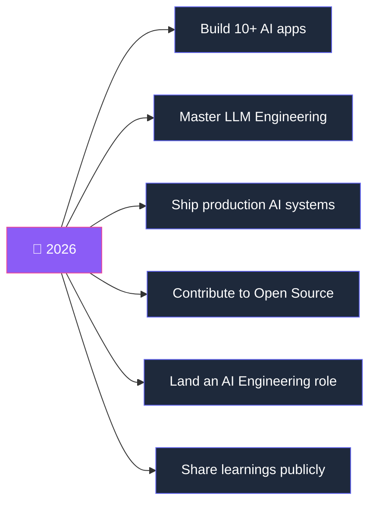

<!--
  ╭─────────────────────────────────────────────╮
  │  Replace every YOUR_USERNAME / YOUR_LINKEDIN │
  │  YOUR_EMAIL / YOUR_PORTFOLIO placeholder      │
  │  with your real values, then commit.          │
  ╰─────────────────────────────────────────────╯
-->

<!-- ===================== HEADER ===================== -->
<a href="https://github.com/YOUR_USERNAME">
  
</a>

<div align="center">

<!-- Animated typing subtitle -->
<a href="https://git.io/typing-svg">
  
</a>

<!-- Profile views + Followers + Stars -->


<br/>

<a href="https://github.com/YOUR_USERNAME?tab=followers">
  
</a>
<a href="https://www.linkedin.com/in/YOUR_LINKEDIN">
  
</a>
<a href="mailto:YOUR_EMAIL">
  
</a>
<a href="https://YOUR_PORTFOLIO">
  
</a>

</div>

<br/>

<!-- ===================== ABOUT ===================== -->
##  About Me

```yaml
name: "Neha Fiaz"
role: "Software Engineer → AI Engineering"
mission: "Build intelligent apps that solve real-world problems"
philosophy: "Learn by building. Ship in public."
currently:
  - Building AI-powered web & mobile applications
  - Deep-diving into LLMs, Agents & RAG
  - Sharing the journey openly
open_to: "AI Engineering opportunities 🚀"
```

> 💡 I combine modern software engineering with Artificial Intelligence to create practical products — while strengthening my fundamentals along the way.

<br/>

<!-- ===================== CURRENT FOCUS ===================== -->
## 🎯 Current Focus

<table>
<tr>
<td width="50%" valign="top">

**🤖 AI Engineering**
- Large Language Models (LLMs)
- AI Agents & Orchestration
- Retrieval-Augmented Generation (RAG)
- Prompt Engineering
- Vector Databases

</td>
<td width="50%" valign="top">

**💻 Software Engineering**
- Full-Stack Web Development
- Cross-Platform Mobile Apps
- Computer Vision
- Clean, production-grade code
- System design fundamentals

</td>
</tr>
</table>

<br/>

<!-- ===================== TECH STACK ===================== -->
## 🛠️ Tech Stack

<div align="center">

#### 🧠 AI & Machine Learning

<br/>


<br/><br/>

#### 🎨 Frontend


<br/><br/>

#### 📱 Mobile

&nbsp;


<br/><br/>

#### ⚙️ Backend & Databases


<br/><br/>

#### 🧰 Tools & Platforms


</div>

<br/>

<!-- ===================== FEATURED PROJECTS ===================== -->
## 🌟 Featured Projects

<table>
<tr>
<td width="50%" valign="top">

### 🌱 Plant Disease Detection
Deep-learning model that classifies plant diseases from leaf images to help farmers act early.

`Python` `PyTorch` `Computer Vision` `Flask`

[**→ View Repo**](https://github.com/YOUR_USERNAME/plant-disease-detection)

</td>
<td width="50%" valign="top">

### 💧 Invora360
SaaS platform for mineral-water plants — inventory, distribution & operations management.

`Next.js` `TypeScript` `Supabase` `Tailwind`

[**→ View Repo**](https://github.com/YOUR_USERNAME/invora360)

</td>
</tr>
<tr>
<td width="50%" valign="top">

### 📱 Cross-Platform Mobile App
A production-ready mobile app built for both iOS & Android from a single codebase.

`React Native` `Expo` `TypeScript`

[**→ View Repo**](https://github.com/YOUR_USERNAME/mobile-app)

</td>
<td width="50%" valign="top">

### 🤖 AI Project — *Coming Soon*
An LLM-powered application currently in the works. Watch this space. 👀

`LLMs` `RAG` `AI Agents`

[**→ Follow along**](https://github.com/YOUR_USERNAME)

</td>
</tr>
</table>

<br/>

<!-- ===================== GITHUB STATS ===================== -->
## 📊 GitHub Analytics

<div align="center">


<br/>


<br/><br/>

<!-- Trophies -->


</div>

<br/>

<!-- Contribution activity graph -->
<div align="center">

</div>

<br/>

<!-- Snake contribution animation -->
<!--
  To enable the snake: add the workflow file at
  .github/workflows/snake.yml (see repo README setup notes),
  it auto-generates the snake SVG into the "output" branch.
-->
<div align="center">

</div>

<br/>

<!-- ===================== 2026 GOALS ===================== -->
## 🎯 2026 Goals



<br/>

<!-- ===================== CONNECT ===================== -->
## 🤝 Let's Connect

<div align="center">

I'm always open to collaboration, AI conversations, and new opportunities. Reach out!

<a href="https://www.linkedin.com/in/YOUR_LINKEDIN">
  
</a>
<a href="https://YOUR_PORTFOLIO">
  
</a>
<a href="mailto:YOUR_EMAIL">
  
</a>
<a href="https://twitter.com/YOUR_TWITTER">
  
</a>

</div>

<br/>

<!-- ===================== FOOTER ===================== -->
<div align="center">

### 💡 Building AI-powered products, one project at a time.

*"The best way to predict the future is to build it."*


</div>
